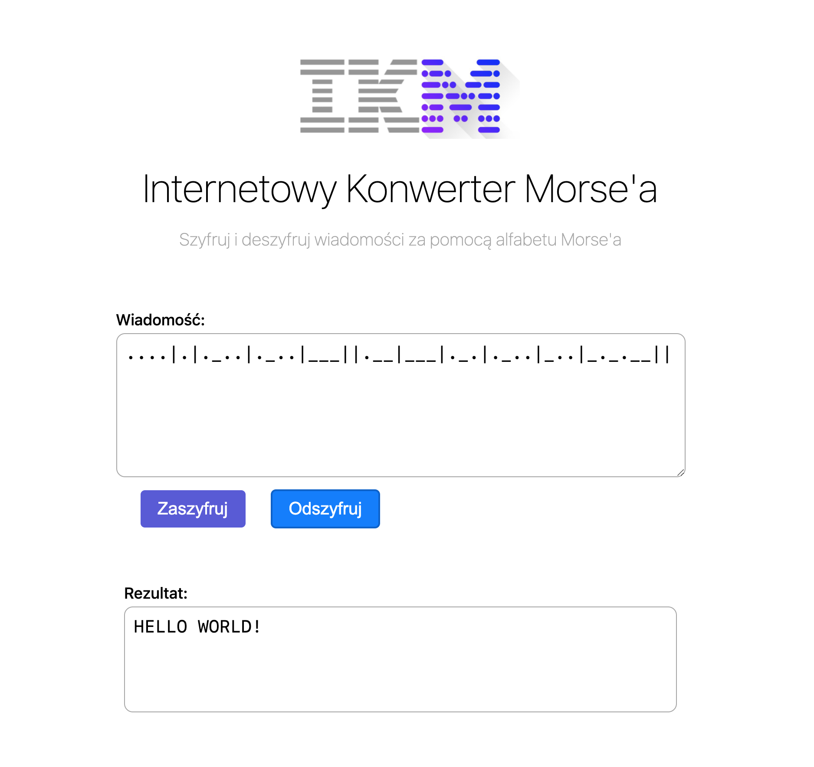

# Internetowy Konwerter Morse'a
> This is a simple app showing Morse coding and encoding messages. Written in vanilla JavaScript, HTML and CSS. 

## General info
The goal of this project is to show that I am familiar with mapping characters.

## Technologies
- Javascript
- HTML
- CSS

## Screenshots

## Usage
Download all files or clone repository to your local machine and open `index.html` 
